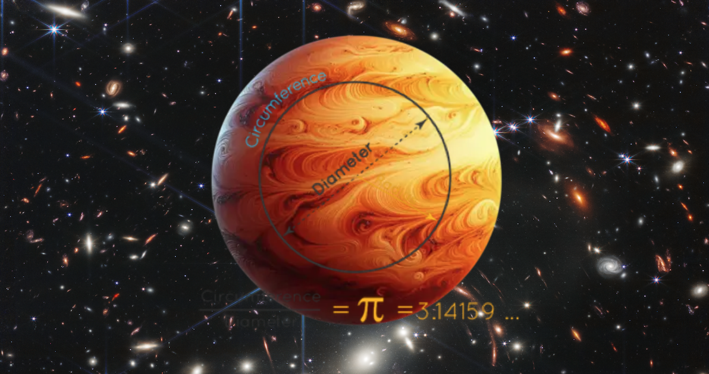
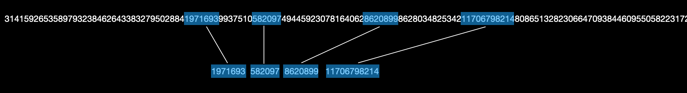
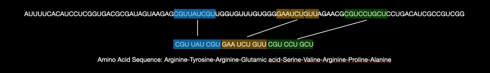
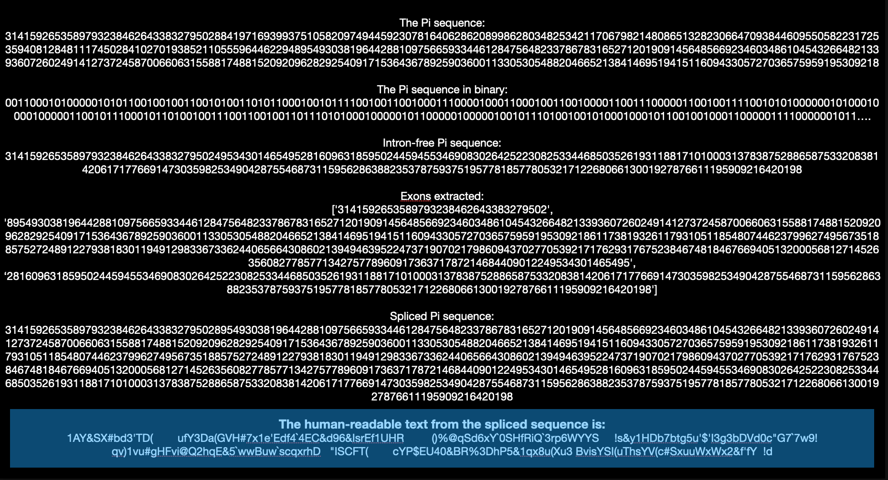

# π Signal Sequence Splicing with Machine Learning for Theoretical Exploration

- Dare to dream
- Ignite your inspiration and innovation
- Strive for excellence
- Discover the universe together and unlock the depths of knowledge and exploration.

------------------------------

"Pi Signal Sequence Splicing" represents a pioneering fusion of mathematical precision and biological processes for interstellar communication. By integrating the infinite, non-repeating sequence of Pi (π) with the principles of DNA and RNA, this innovative methodology uses Pi as a universal language for encoding complex messages that could potentially be understood by extraterrestrial intelligence. Drawing analogies between the splicing of genetic material and the manipulation of Pi sequences, this approach introduces a novel paradigm for cosmic information transmission.

----------------------------------
The PI Sequence:

----------------------------------
The RNA Sequence:

----------------------------------

The concept’s uniqueness is amplified through the application of Machine Learning (ML) techniques, which enhance the theoretical exploration of Pi sequence splicing. ML algorithms help identify significant patterns within Pi's digits, optimize splicing methods, and simulate how extraterrestrial beings might interpret these encoded messages. This integration of ML enables researchers to investigate diverse combinations of Pi splices, uncover hidden structures, and refine the encoding and decoding processes, pushing the boundaries of our understanding in this groundbreaking field.

Just as DNA undergoes replication, transcription, and translation to form the essential proteins for life, "Pi Signal Sequence Splicing" innovatively blends mathematical and biological principles. This approach bridges the gap between abstract mathematical constants and the fundamental processes of life, offering a unique perspective on information exchange on a cosmic scale.

## Conclusion:

This concept bridges multiple disciplines, including interstellar communication strategies, the universality of mathematical constants, and the parallels between biological processes and information theory. Its distinctive approach makes it a compelling subject for further exploration and speculative research, which I am eager to pursue or collaborate on.

